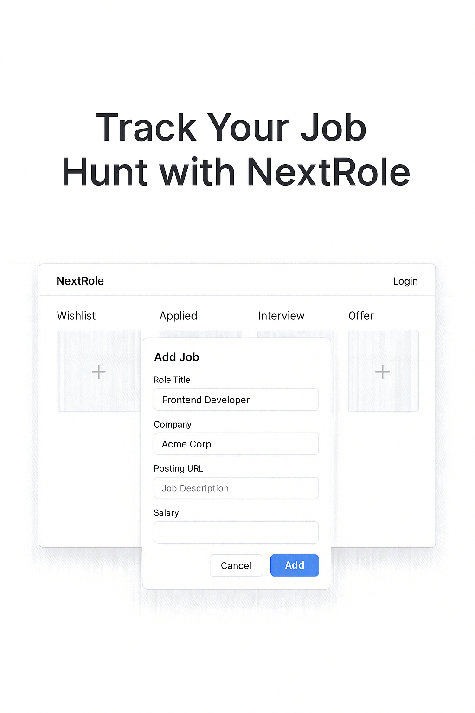

# 🧭 NextRole

**NextRole** is a job application tracker built for junior developers who want to stay organized, focused, and in control of their job hunt. Easily track applications, create custom job boards, and manage progress from wishlist to offer — all in one clean, visual interface.



---

## 🚀 Features

- ✅ **Visual Job Board** – Drag & drop across stages: Wishlist, Applied, Interview, Offer
- ➕ **Add Jobs Easily** – Use modals to add role, company, job URL, salary & more
- ✏️ **Edit & Delete Jobs** – Quick modal access and card hover actions
- 🔐 **Authentication** – Secure user login & account-based boards
- 🧠 **Custom Boards** – Create and manage multiple job boards
- 🔗 **Quick Access** – Click through to job listings directly from each card

---

## 📸 Screenshots

> _Coming soon: final UI designs and live demo GIFs_

---

## 📦 Tech Stack

- **Frontend:** [Next.js](https://nextjs.org/), [React](https://reactjs.org/), [Tailwind CSS](https://tailwindcss.com/), [Shadcn UI](https://ui.shadcn.com/)
- **Backend:** [Next.js API Routes]
- **Auth:** [BetterAuth](https://www.better-auth.com/)
- **Database:** [PostgreSQL](https://www.postgresql.org/) + [Neon Serverless](https://neon.com/)
- **Drag & Drop:** [@dnd-kit](https://dndkit.com/)
- **Deployment:** [Vercel](https://vercel.com/) + [Railway](https://railway.app/) or [Render](https://render.com/) (TBD)

---

## 🛠️ Installation

```bash
git clone https://github.com/your-username/nextrole.git
cd nextrole
npm install
